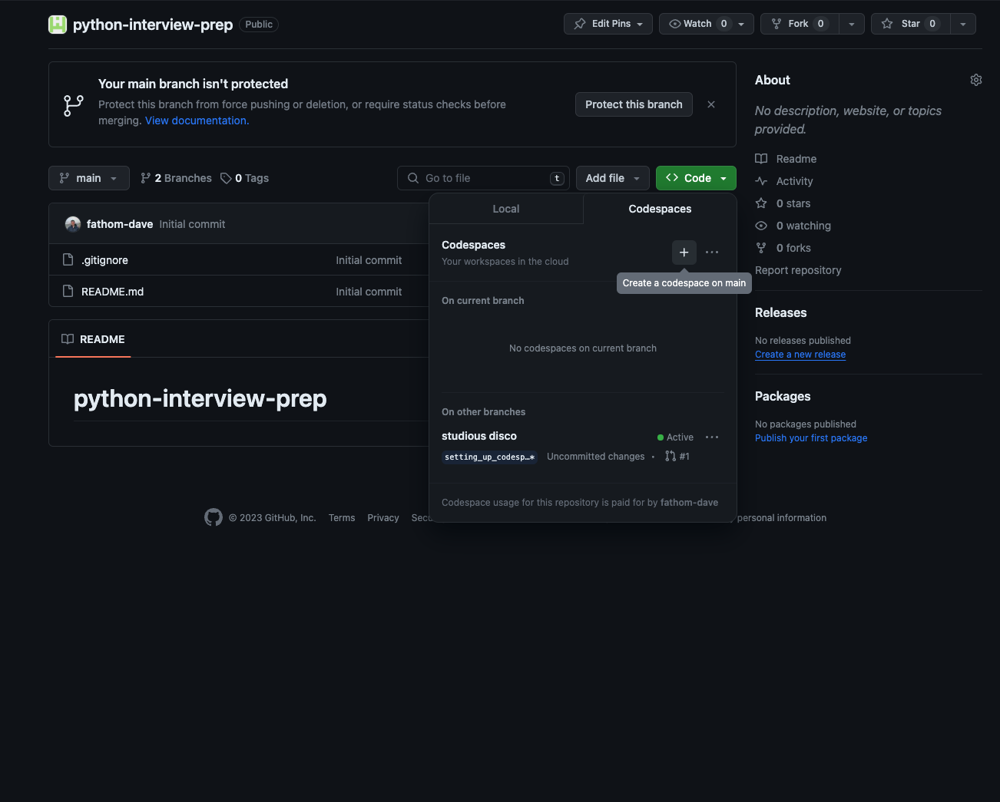
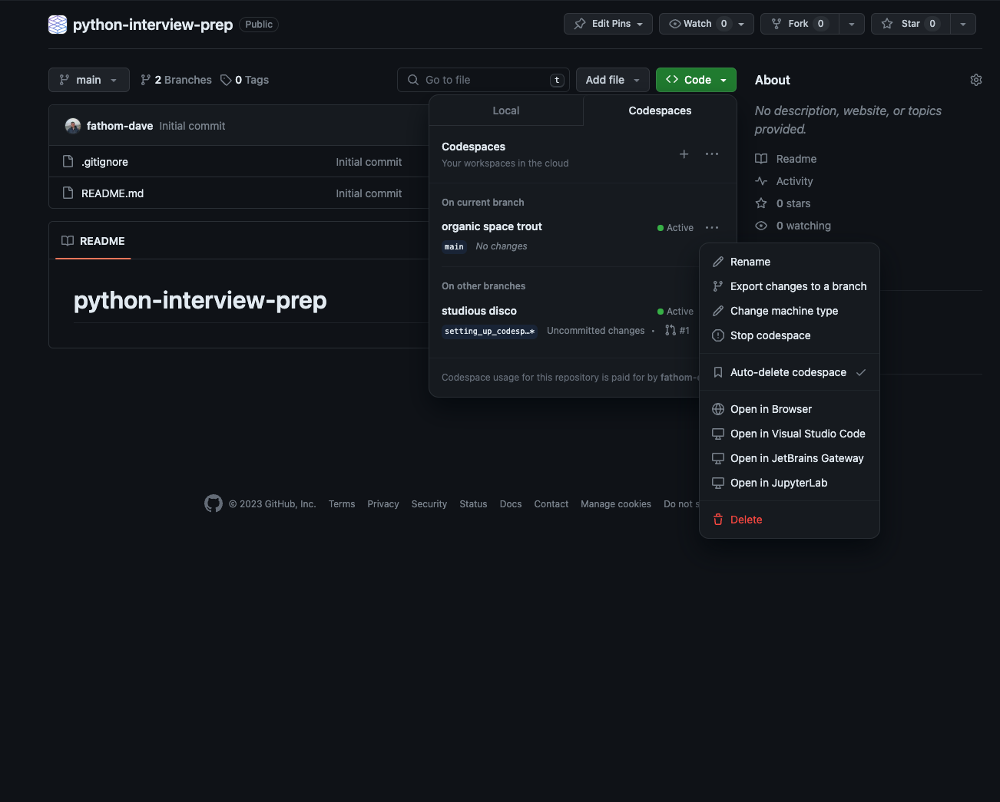

# Python Interview Prep

Thanks for interviewing at Fathom. To make sure you're prepared before your interviews, we'd like to have you test out the interview coding environment in advance. This process should at most take 5 minutes.

For some of our interviews we'll be using Github Codespaces to give you a repo and development environment similar to what you'd use in your day-to-day job. Please work through the following guide to make sure you understand Github Codespaces, how to use the development environment and the toolchain. 

## Setting Up

### 1. Opening Github Codespaces

Simply click this button 

If that didn't work for you, in this repository navigate to the `Code` button, the `Codespaces` tab then click the + sign. This will open up a codespace in a new tab.

NOTE: It may take a minute or two for the container running the development environment to build.

### 2. Familiarize Yourself with VSCode

In the new tab, you'll have a full fledged [Visual Studio Code](https://code.visualstudio.com/), shortened to VSCode, and container to build and test your code in. Each interview will have a different VSCode and container managed by Codespaces that will be pre-installed with all of the software you'll need to complete the set of tasks. For the purposes of interviewing you will only be allowed the extensions and tools given to you in a VSCode instance.

Take a look around and use this as a playground. Be sure you understand how to:
- Find and navigate the file structure
- Open a terminal
- Use git to create commits

### 3. Test Scenario

If you think you're ready, try this quick task and answer the following questions. No need to record your answers.

1. Run `make run`.
    - What is the output? What file that was run?
2. Edit the file run in 1. and insert your name in the output.
3. Run `make test`
    - What test broke? What file did the test break in?
4. Fix the test
5. Format and lint your code by running `make lint fix`
6. Commit your changes

### 4. Tear Down

If you got here and completed everything, looks like you're ready! To close a codespace, simply close the tab. In the repository, click `Code`, the `Codespaces` tab then click the ellipsis sign next to your codespace name then Delete (you may need to refresh the page before doing this). You will be required to do this at the end of each question.

